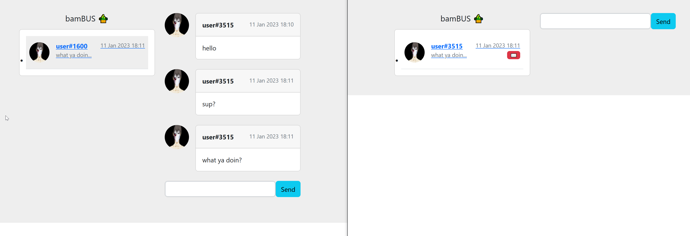
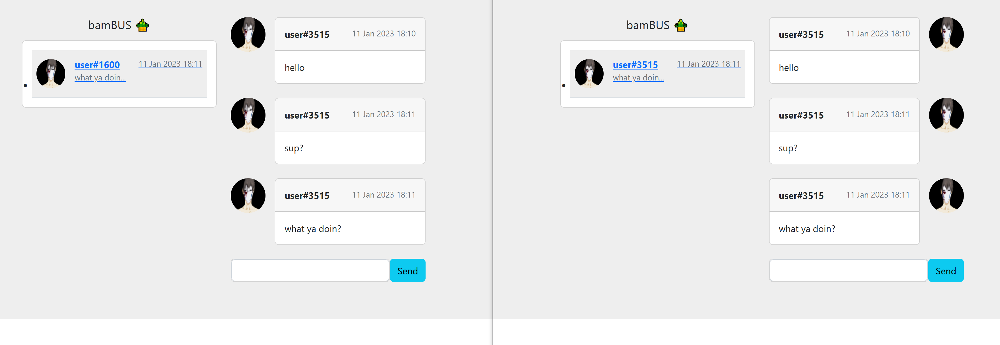

# BUS-e2e-communicator
## czyli projekt bamBUS :bamboo:

# Installation : 
1. go to main folder 
2. run `docker-compose up --build`

# How to use :

When you run app firstly you have to regiser user so make a get request to : 
* http://127.0.0.1:5001/register
* http://127.0.0.1:5002/register

When you have user registered you are free to go. 
Open http://127.0.0.1:5001/chat in your browser. This is client 1. Client 2 is on port 5002 by default.
To send a msg to a new person just simply add ?chch=*username* (you have to change # to - in a nickname)
when you send msg it should show after refresh in other guy window. 

Msgs are encrypted and server can't read em. 

HF using it.

some pics :

# Plan : 

